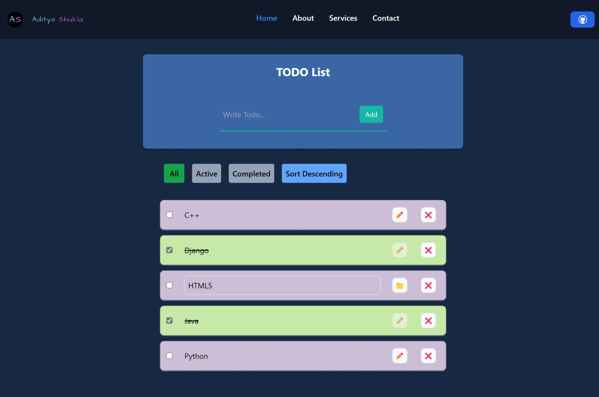

<div align="center">
<h3 align="center">React To-Do List</h3>
      
  <br />

  <!-- <div>
    
  </div> -->
</div>

## 📋 <a name="table">Table of Contents</a>

1. 🤖 [Introduction](#introduction)
2. ⚙️ [Tech Stack](#tech-stack)
3. 🔋 [Features](#features)
4. 🤸 [Quick Start](#quick-start)
5. 🕸️ [Snippets](#snippets)

## <a name="introduction">🤖 Introduction</a>

The React To-Do List component allows users to add, remove, and mark tasks as completed. This component validates task input, dynamically displays tasks, and offers optional features such as sorting, filtering, and localStorage integration. It is built using Vite and Tailwind CSS, with state management handled through the TodoContext.

Used `vite` as Vite offers faster build times compared to Create-React-App due to its pre-bundling and efficient hot module replacement 

## <a name="tech-stack">⚙️ Tech Stack</a>

- React.js
- Tailwind
- Context API


## <a name="features">🌟 Features</a>

👉 **Task Addition/Removal**: Users can add new tasks or remove tasks from the list.

👉 **Dynamic Display**: Tasks are dynamically displayed on the UI.

👉 **Sorting**: Tasks can be sorted in ascending or descending order.

👉 **Filtering**: Tasks can be filtered by their completion status.

👉 **LocalStorage Integration**: Tasks are saved to and loaded from localStorage, preserving the list across page reloads.

## <a name="quick-start">🤸 Quick Start</a>

**Prerequisites**

Follow these steps to set up the project locally on your machine.

Make sure you have the following installed on your machine:

- Git
- Node.js
- npm (Node Package Manager)

**Cloning the Repository**

```bash
git clone https://github.com/Aditya10403/React-TodoList.git
cd React-TodoList
```

**Running the Project**

Install dependencies
```bash
npm install # or npm i
```

Start the server:
```bash
npm run dev
```

- Open your browser and navigate to `http://localhost:5173`. 

**How to Use**

👉 **Adding a Task**: 
- Enter a task in the input field and press the `Add` button.
- The task will appear in the list below.

👉 **Marking a Task as Completed**: 
- Click on the checkbox next to a task to mark it as completed.
- The task will be visually indicated as completed.

👉 **Removing a Task**: 
- Click on the ❌ button next to a task to remove it from the list.

👉 **Updating a Task**: 
- Click on the ✏️ button next to a task to edit it.
- The task's text will be loaded into the input field for editing.
- Modify the text and press the 📁 button again to save the changes.

👉 **Sorting Tasks**: 
- Use the sort option to order tasks alphabetically in ascending or descending order.

👉 **Filtering Tasks**: 
- Use the filter options to view `All` tasks, only `Completed` tasks, or only `Active` tasks.

## <a name="snippets">🕸️ Snippets</a>

<details>
<summary><code>vite.config.js</code></summary>

```javascript
import { defineConfig } from "vite";
import react from "@vitejs/plugin-react";

// https://vitejs.dev/config/
export default defineConfig({
  plugins: [
    react(),
  ],
  resolve: {
    alias: {
      "@mui/styled-engine": "@mui/styled-engine-sc",
    },
  },
});

```

</details>

<details>
<summary><code>tailwind.config.js</code></summary>

```javascript
/** @type {import('tailwindcss').Config} */
export default {
  content: [
    "./index.html",
    "./src/**/*.{js,ts,jsx,tsx}",
  ],
  theme: {
    extend: {},
  },
  plugins: [],
}
```

</details>


## <a>🚨 Disclaimer</a>

The ToDo List implemented here is intended for educational purposes only.

#

